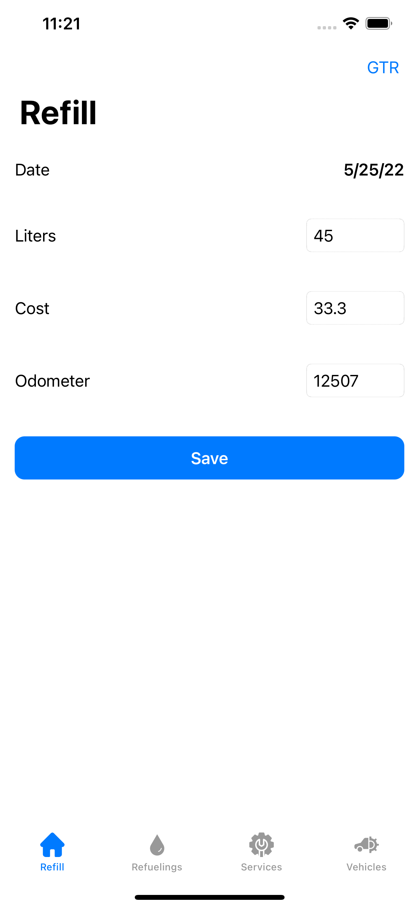
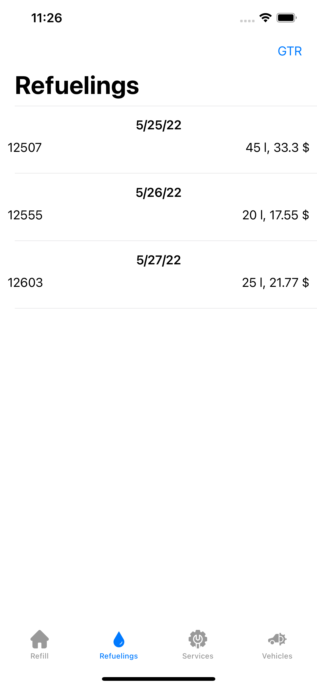
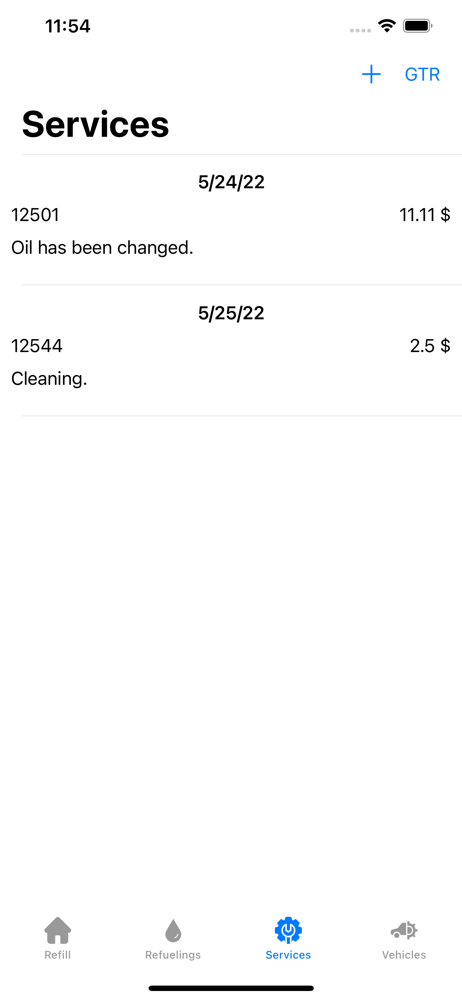
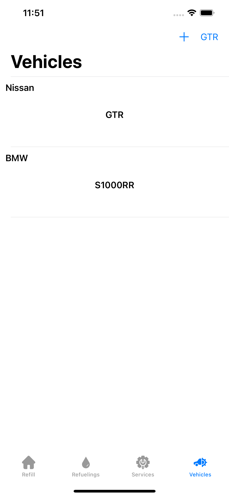

# ``Refuel``

Download on the [App Store](https://apps.apple.com/ru/app/refuelme/id1626216795).

## Overview

Track fuel consumption for all your cars or motocycles.

### Features

- You can keep track of fuel prices, liters used and money spent on fuel and services.

<table>
<tr>
<td></td>
<td></td>
</tr>
<tr>
<td></td>
<td></td>
</tr>
</table>

### Documentation

Refuel' Swift-DocC documentation is [available here](https://leonidcbr.github.io/Refuel/documentation/refuel).
